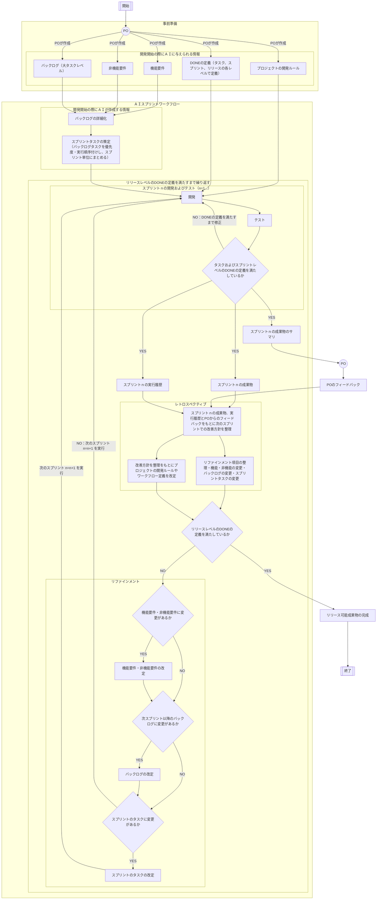

```mermaid

flowchart TB

  start[["開始"]]

  subgraph "事前準備"
    po_node_1(("PO"))

    subgraph "開発開始の際にＡＩに与えられる情報"
      direction LR
        input_1["機能要件"]
        input_2["非機能要件"]
        input_3["バックログ（大タスクレベル）"]
        input_4["プロジェクトの開発ルール"]
        input_5["DONEの定義（タスク、スプリント、リリースの各レベルで定義）"]
    end
  end

  subgraph "ＡＩスプリントワークフロー"
    direction TB

    subgraph "開発開始の際にＡＩが作成する情報"
        ai_make_1["バックログの詳細化"]
        ai_make_2["スプリントタスクの策定（バックログタスクを優先度・実行順序付けし、スプリント単位にまとめる）"]
    end

    subgraph "リリースレベルのDONEの定義を満たすまで繰り返す"
      direction LR

      subgraph "スプリントｎの開発およびテスト（n=1...）"
        direction LR
        ai_dev_1["開発"]
        ai_test_1["テスト"]
        ai_sprint_check_1{"タスクおよびスプリントレベルのDONEの定義を満たしているか"}
      end

      ai_output_1["スプリントｎの成果物"]
      ai_output_2["スプリントｎの成果物のサマリ"]
      ai_output_3["スプリントｎの実行履歴"]

      subgraph "レトロスペクティブ"
        direction LR
        ai_retrospective_1["スプリントｎの成果物、実行履歴とPOからのフィードバックをもとに次のスプリントでの改善方針を整理"]
        ai_retrospective_2["リファインメント項目の整理・機能・非機能の変更・バックログの変更・スプリントタスクの変更"]
        ai_retrospective_3["改善方針を整理をもとにプロジェクトの開発ルールやワークフロー定義を改定"]
      end

      ai_release_decision{"リリースレベルのDONEの定義を満たしているか"}

      subgraph "リファインメント"
        direction LR
          ai_refinement_1{"機能要件・非機能要件に変更があるか"}
          ai_refinement_2["機能要件・非機能要件の改定"]
          ai_refinement_3{"次スプリント以降のバックログに変更があるか"}
          ai_refinement_4["バックログの改定"]
          ai_refinement_5{"スプリントのタスクに変更があるか"}
          ai_refinement_6["スプリントのタスクの改定"]
      end
    end
  end

  shippable_product["リリース可能成果物の完成"]
  po_node_2(("PO"))
  po_feedback["POのフィードバック"]
  goal[["終了"]]

  start --> po_node_1

  po_node_1 --> |POが作成| input_1
  po_node_1 --> |POが作成| input_2
  po_node_1 --> |POが作成| input_3
  po_node_1 --> |POが作成| input_4
  po_node_1 --> |POが作成| input_5

  input_1 --> ai_make_1
  input_2 --> ai_make_1
  input_3 --> ai_make_1
  input_4 --> ai_dev_1
  input_5 --> ai_dev_1

  ai_make_1 --> ai_make_2
  ai_make_2 --> ai_dev_1

  ai_dev_1 --> ai_test_1
  ai_test_1 --> ai_sprint_check_1
  ai_sprint_check_1 --> |YES| ai_output_1
  ai_sprint_check_1 --> |YES| ai_output_2
  ai_sprint_check_1 --> |YES| ai_output_3
  ai_sprint_check_1 --> |NO：DONEの定義を満たすまで修正| ai_dev_1

  ai_output_1 --> ai_retrospective_1
  ai_output_2 --> po_node_2
  po_node_2 --> po_feedback
  po_feedback --> ai_retrospective_1
  ai_output_3 --> ai_retrospective_1

  ai_retrospective_1 --> ai_retrospective_2
  ai_retrospective_1 --> ai_retrospective_3
  ai_retrospective_2 --> ai_release_decision
  ai_retrospective_3 --> ai_release_decision

  ai_release_decision --> |YES| shippable_product
  ai_release_decision --> |NO| ai_refinement_1

  ai_refinement_1 --> |YES| ai_refinement_2
  ai_refinement_1 --> |NO| ai_refinement_3
  ai_refinement_2 --> ai_refinement_3
  ai_refinement_3 --> |YES| ai_refinement_4
  ai_refinement_3 --> |NO| ai_refinement_5
  ai_refinement_4 --> ai_refinement_5
  ai_refinement_5 --> |YES| ai_refinement_6
  ai_refinement_5 --> |NO：次のスプリント n=n+1 を実行| ai_dev_1
  ai_refinement_6 --> |次のスプリント n=n+1 を実行| ai_dev_1

  shippable_product --> goal

```
