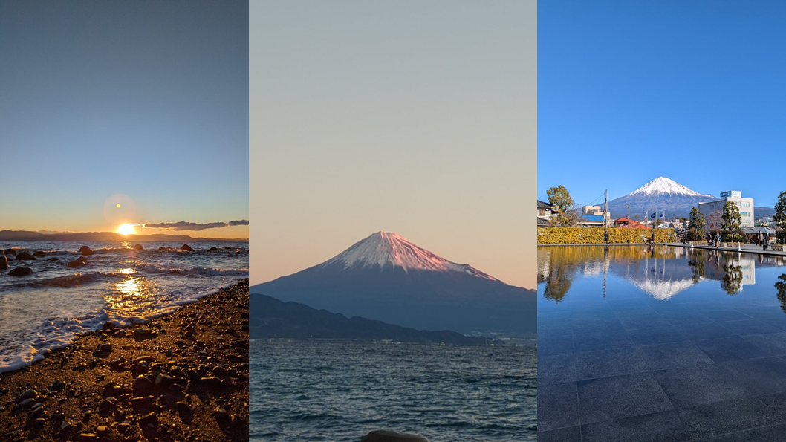
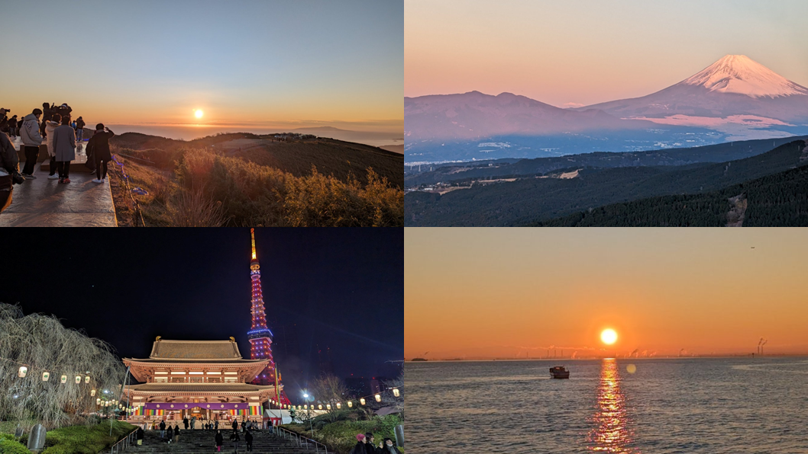
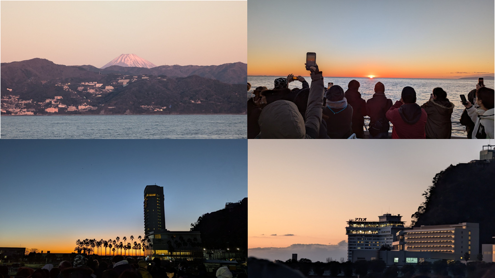

<!-- テーマファイルが同じディレクトリにある場合 -->

# ちょっと変わった年始の過ごし方

## ウメタニ

---

# 年末年始とは

## 年越しそばを食べ、紅白とかTVを見て、ゆく年くる年をコタツでぬくぬくすること

---

# というのも日本的な情緒にあふれていてよいですが

---

# もう少しエクストリームな年始の過ごし方をご紹介

---

# 以外に穴場

# →　新春初日の出・初詣バスツアー

---

# 初日の出・初詣バスツアーとは

## 各旅行企画会社が年末年始に販売しているパッケージ商品

- 高いものは数万かかったりしますが、数千円の格安ツアーもあります。
- 3回くらい参加してみてますが、普段いかない時間帯に普段いかない場所に行けるので結構おもしろい。

---

# 安いの・高いのどっちが好き

## 安いの

- 理由
  - 値段が高いパッケージは結構完売するけど天気が悪かったら残念
  - 格安パスツアーは集客命なのでクリスマス頃でも予約できたりする
    - 天気予報を見て決められる
      - 確実ではないけど良い体験になる確度は高い
  - 高額ツアーは宿泊込みだったりもするけど、エクストリームではない
  - 結局のところ料理が豪華とかバスの質がいいとか位じゃないか？

---

# どんなことするの

- 深夜（0時～1時ごろ）に新宿とか東京駅に集合
- 高速バスに乗りひたすら移動
- やかましいおばちゃん集団がいないことだけ神に祈る
- バス移動中はとりあえず寝る
- 初日の出・初詣を巡回
- ツアーによっては初湯（温泉）もある
- ツアーによっては初富士も見れる
- 昼前に解散

---

# どんな人が参加してるの

- 家族連れ
- おばちゃん集団
- カップル
- 外国人（旅行客）
- ソロおじ

---

# バスつらくない？

## つらく なくはない

でもまぁリクライニングもできるしノイキャンイヤフォンして寝るし

---

# おすすめツアーってある？

| 評 | 場所 | 所感 |
|:--|:--|:--|
| 〇 | 十国峠展望台 | 山の上から登る初日の出、背面には富士山まるみえ |
| 〇 | 熱海湾上のフェリー | バス＋フェリーのツアーがあった 海から陸や箱根山越しの富士山も見れる |
| △ | 三保の松原 | 静岡市の向こうまで行くので、遠かった 赤富士が見えるのはすごく良い 浜に出るので靴に砂が入ってしまった（靴選び失敗） |
| × | 箱根神社 | 神社はよかったけど道中の道路が狭く混んでいたため 予定よりも時間がかかりツアースケジュールが カツカツになった。|

---

# 何か面白いことあった？

今年のバスで相席したのがイタリア人観光客のナイスガイで、バス中で会話したりして仲良くなったってインスタ交換した。

ちょうどいま名古屋にまた観光に来てるっぽい。

---

# バス以外のエクストリームは無いのか

日の出桟橋から、羽田空港近くの湾上まで出て初日の出を見るやつがある

これ超格安、3000円くらい

6時出発だけど元旦は山手線が24時間営業なので都内JR沿線に出れる人だったら問題なし

これ行った年はカウントダウンイベント行って、増上寺で初詣して、竹芝から海に出るというドタバタコースにした

---

---

---

---

# 撮れ高が、高い
